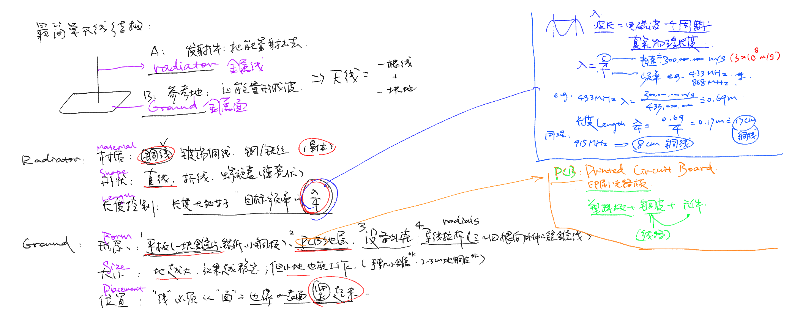

## 天线入门

```
先从最简单的理论值入手，记一下最基础的要素。
至于背后的原理、以及实际上究竟是不是四分之一波长等等，之后再拓展。
```


  
- [四分之一波长天线长度计算网站](https://www.66pacific.com/calculators/quarter-wave-vertical-antenna-calculator.aspx?utm_source=chatgpt.com)

- 常用天线速查表格。
  - 按照大致的用途领域分了六类。当然所有的放一张大表格也可以，这个只是方便我快速查看。
  - 不急着进一步细化，先主要用来熟悉天线的3+3六大要素。

- 表头说明如下。具体表格当中的表头我都用英文缩写。

| Antenna (Common Name) | Radiator: Material | Radiator: Geometry | Radiator: Elec. Length | Ground: Form | Ground: Size | Ground: Placement | Typical Domain |
|------------------------|--------------------|---------------------|-------------------------|---------------|----------------|---------------------|------------------|
| Antenna（天线名） | Rad-Mat（辐射体材料） | Rad-Geo（辐射体形状） | Rad-Len（电气长度） | Gnd-Form（地面形态） | Gnd-Size（地面大小） | Gnd-Pos（地面位置） | Domain（应用领域） |
|                        |                    |                     |                         |               |                |                     |                  |


### 1. Primitive / Basic Wire
  
| Antenna | Rad-Mat | Rad-Geo | Rad-Len | Gnd-Form | Gnd-Size | Gnd-Pos | Domain |
|------------------------|--------------------|---------------------|-------------------------|---------------|----------------|---------------------|------------------|
| 一根线天线（Bare Wire） | 铜线 | 直线 | λ/4 | PCB GND / 小金属 | 小 | 随便插 | 实验、DIY、教学 |
| 手工铜线天线 | 铜线 | 直线 | λ/4 | 任意金属面 | 小-中 | 边缘接出 | DIY、临时天线 |

### 2. DIY / Maker-Level
  
| Antenna | Rad-Mat | Rad-Geo | Rad-Len | Gnd-Form | Gnd-Size | Gnd-Pos | Domain |
|------------------------|--------------------|---------------------|-------------------------|---------------|----------------|---------------------|------------------|
| 螺旋弹簧天线（Helical Coil） | 金属弹簧 | 螺旋 | 缩短 λ/4 | PCB GND | 小 | PCB 焊盘 | LoRa 节点、小设备 |
| PCB IFA（倒 F 天线） | PCB 铜皮 | 倒 F | λ/4 | PCB GND | 小 | 板边 | Wi-Fi/BT/LoRa 模块 |
| PCB Meander（折线） | PCB 铜皮 | 折线 | 缩短 λ/4 | PCB GND | 小 | 边缘贴地 | 小空间设备 |
| FPC 天线（柔性贴片） | FPC 铜膜 | IFA/折线 | 缩短 λ/4 | 设备金属 | 小-中 | 内部贴装 | IoT、小家电 |
| 玻璃贴片天线 | 金属箔 | IFA/PIFA | 缩短 | 玻璃载体 | 小 | 贴玻璃 | 车载、OBU |

### 3. Consumer / Handheld
  
| Antenna | Rad-Mat | Rad-Geo | Rad-Len | Gnd-Form | Gnd-Size | Gnd-Pos | Domain |
|------------------------|--------------------|---------------------|-------------------------|---------------|----------------|---------------------|------------------|
| 小黑胶棒天线（LoRa/433） | 金属弹簧 | 螺旋 | 缩短 λ/4 | SMA 底座 | 小 | SMA 竖起 | LoRa、特小型设备 |
| 对讲机原装天线（Rubber Duck） | 金属杆 + 线圈 | loaded whip | 缩短 λ/4 | 手台机身金属 | 中 | 顶部 | 对讲机 |
| 手持拉杆天线（Whip） | 金属杆 | 直线 | λ/4 或 5/8 λ | 机身金属 | 中 | 顶部馈电 | 业余电台 VHF/UHF |
| Wi-Fi 路由器胶棒天线 | 金属杆/loaded | loaded monopole | λ/4 | RP-SMA 底座 | 小 | 可旋转 | Wi-Fi AP |
| 蓝牙/Wi-Fi PCB 天线 | PCB 铜皮 | 折线/IFA | λ/4 | PCB GND | 中 | 板边 | BLE、Wi-Fi 模块 |
| 手机 LTE 天线（PIFA） | 金属贴片 | PIFA | 电气缩短 | 手机金属框 | 中-大 | 边缘贴装 | LTE/5G 手机 |

### 4. Vehicle / Outdoor / Industrial
  
| Antenna | Rad-Mat | Rad-Geo | Rad-Len | Gnd-Form | Gnd-Size | Gnd-Pos | Domain |
|------------------------|--------------------|---------------------|-------------------------|---------------|----------------|---------------------|------------------|
| 车载磁吸天线 | 金属杆 | 直线 | λ/4 | 车顶金属 | 大 | 磁盘中心 | 车载台、LoRaWAN |
| 玻璃钢天线（FRP Antenna） | 内部金属杆 | 直线 or loaded | λ/2 / λ/4 | 金属底座 | 中-大 | 屋顶/塔杆 | 室外站点、LoRaWAN |
| 全向天线（Omni） | 铜管/金属杆 | 垂直直线 | 多节 collinear | 底座金属 | 中-大 | 竖装 | 工业通信 |
| 工控“香菇头”天线 | 金属片阵列 | 小型贴片 | 多频 | 大金属底座 | 中 | 顶装 | 工控路由/AP |
| 工控“小钢炮”天线 | 铜管+加载 | 长杆全向 | 多谐振 | 大底盘 | 大 | 竖装 | 4G/5G 工控 |
| M2M 工业天线 | FPC/金属杆 | 多模式 | 多频 | 金属底盘 | 中 | 设备壳体 | 工业 M2M、车队管理 |

### 5. Directional / Higher-End
  
| Antenna | Rad-Mat | Rad-Geo | Rad-Len | Gnd-Form | Gnd-Size | Gnd-Pos | Domain |
|------------------------|--------------------|---------------------|-------------------------|---------------|----------------|---------------------|------------------|
| 八木天线（Yagi） | 多金属杆阵列 | 反射+振子+导向 | 特定谐振 | 主反射板 | 中-大 | 反射器侧 | 方向通信、卫通 |
| 双八木 / 栅格八木 | 金属杆阵列 | 多单元阵列 | 优化谐振 | 金属背网 | 大 | 反射阵列 | 长距离点对点 |
| 平板天线（Panel） | 贴片阵列 | Patch array | 多频贴片 | 大反射面 | 大 | 挂墙 | 室外 AP、5G 小站 |
| 抛物面天线（锅盖、雷达锅） | 馈源金属杆 | 小 feed | λ/2 | 抛物面反射盘 | 大 | 焦点安装 | 微波链路、卫星 |
| 格栅天线（Grid） | 金属丝网 + feed | 小 patch 或 dipole | 特定谐振 | 大网状反射器 | 大 | 指向安装 | 抗风、点对点 |

### 6. High-End / Specialized / Modern
  
| Antenna | Rad-Mat | Rad-Geo | Rad-Len | Gnd-Form | Gnd-Size | Gnd-Pos | Domain |
|------------------------|--------------------|---------------------|-------------------------|---------------|----------------|---------------------|------------------|
| Helix 大型螺旋天线 | 铜带 | 大螺旋 | 多圈 λ/4/λ/2 | 金属底盘 | 大 | 垂直安装 | 卫星通信、深空 |
| Patch Array（多贴片阵列） | 金属贴片 | Patch array | 多频谐振 | 大反射面 | 大 | 室外安装 | 5G/微波 AP |
| Massive MIMO（多通道天线） | 多贴片/IFA 阵列 | 多天线矩阵 | 多模式谐振 | 大底盘 | 大 | 塔站/室外 | 5G NR、LTE-A |
| mmWave 阵列 | 微型贴片 | 高频阵列 | 28/39GHz | 小反射面 | 小 | 边缘贴框 | 5G 毫米波 |
| NFC 天线 | 铜线圈 | 多匝螺旋 | 谐振结构 | PCB 局部地面 | 小 | 贴局部 | NFC/支付 |


 