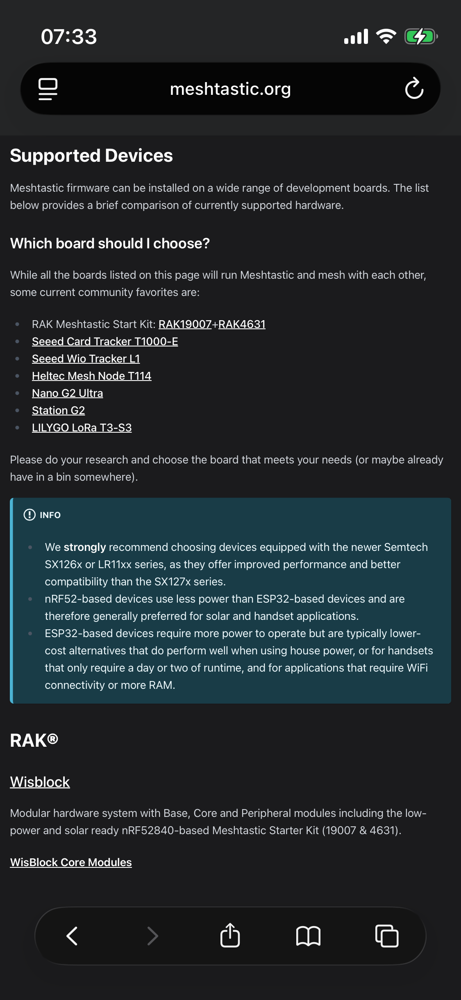

## ESP32- 和 nRF52-

```
买了两个设备试了一下
```

- 先从闲鱼买了两个相对便宜、开箱即用的设备，开机跑一遍。这部分没有太大难度。
  - 设备到货，开机看看界面。
  - 蓝牙连手机App或者数据线连电脑CLI改各种配置。这两种改配置的方式都可以试一下，不会可以先问AI。
  - 也可以拆开看看设备内部组成。

- 设备方面，主要就是看一下你即将购买的设备使用的MCU是【ESP32-】还是【nRF52】，可以各买一台体验一下。拿[餐盘](../content/mesh20251116.md)的比喻来讲，就是A餐格这一格，食堂主要供应这两种菜，你可以两种都吃了试一下感觉。如果决定真正去了解mesh的话，我感觉手头有这两块MCU还是有必要的。

- 我一开始比较关心的像GPS、键盘等等属于[餐盘](../content/mesh20251116.md)里面的D餐格，这就比较灵活，你可以选择其中某台设备搭载部分功能、体验一下配置的修改，也可以先暂时不用。
    
- 比方说，我一开始购买的nRF52-设备没有额外装GPS（也可以选有GPS的，我当时基本没看，就买了个最便宜的）、使用18650电池，可以体验超长待机，好几天没有充电；另一台ESP32-设备有GPS、Wi-Fi等等，不过耗电很快（可能我开了很多功能，出门吃了个肯德基早餐就没电了，我吃的肉酥饭团和热拿铁）。因此，ESP32-设备我打算就放在固定位置当节点，nRF52-的可以带着跑、只是要跟手机呆一起。当然这两台设备的耗电差异跟很多因素有关，我这边不是控制变量法做实验，电池都不一样，只是非常粗略、甚至有点想当然地做了判断，为的是进一步搜资料。然后就搜到官网说明：


*rcarteraz, (n.d.). Devices | Supported Hardware Overview. Meshtastic. https://meshtastic.org/docs/hardware/devices/  （阅览日期：2025年11月22日）*
  
- 中间INFO高亮部分翻译（ChatGPT5.1）

> 我们强烈建议选择搭载 Semtech SX126x 或 LR11xx 系列射频芯片的设备，因为这些芯片相比 SX127x 系列在性能与兼容性上都有改进。
>  
> - nRF52 系列设备 比 ESP32 系列设备 更省电，因此通常更适用于太阳能供电或手持场景。
>  
> - ESP32 系列设备 功耗更高，但通常价格更低；如果是用**市电**（注：house power，普通插座供电），或者只是需要运行一两天的手持设备，ESP32 也是够用的。另外，ESP32 在需要 WiFi 连接或额外 RAM 的场景中比较合适。

- 购买简易的设备上手都不会有太大阻力。我认为触摸到这项技术的核心在于：理论层面去理解Mesh的组网原理；实践层面则是利用设备去“创造一个比较明确的学习目标”。
   
- 例如，有些设备允许我通过按键修改 GPS 显示逻辑，这就意味着我可以选择“显示GPS、或不显示GPS、或只显示部分GPS数据”。明确这件事之后，我就可以有的放矢地去查GPS的组成、数据结构、坐标格式这些细节。掌握理论知识后再回到设备上，我才能决定是否需要启用某个功能。

- 上面两段属于我的学习方法记录，并非说明设备用途。


