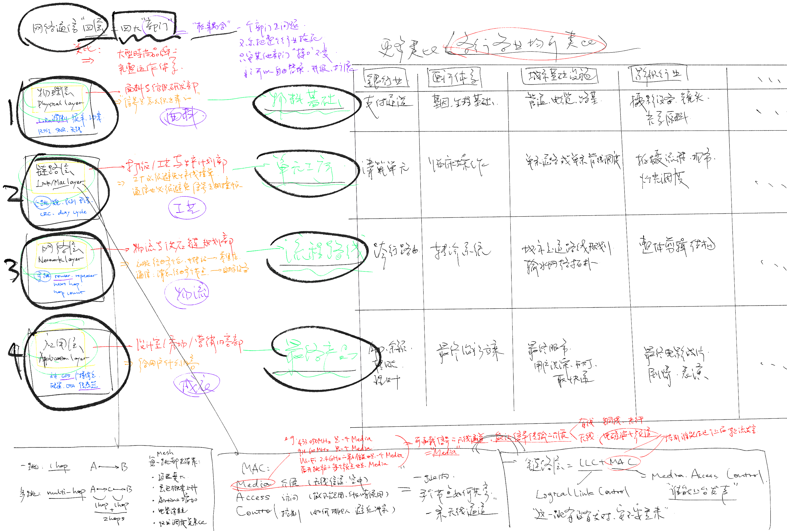

## 网络通信的四层

```
四层=四个部门。可以用其他行业做个类比。
```



Meshtastic里面实际会遇到的所有东西，按照网络通信四层分一下：
（ChatGPT5.1直接复制）

### 1. 物理层（Physical Layer）

| 分类 | Meshtastic 内容 | 说明 |
|------|------------------|------|
| LoRa 调制 | SF / BW / CR | 决定信号形态、距离与速率 |
| 频率与区域 | 433 / 868 / 915 / 920 MHz；Region (CN/EU/US/JP) | 各国分配的免许可频段 |
| 功率 | TxPower（0–23 dBm） | 覆盖能力与发射能量 |
| 接收指标 | RSSI、SNR | 判断一跳信号质量 |
| AirTime | 包在空中的时间 | 决定信道拥塞风险 |
| 射频硬件 | SX1262 / SX1268；LNA / PA；LC 匹配网络 | 实际生成与接收射频 |
| 天线 | 433 / 868 / 915 MHz；SMA 接口 | 发射效率决定通信范围 |
| 其他物理属性 | 频率偏移、灵敏度 | 芯片硬件特性 |

### 2. 链路层（Link / MAC Layer）

| 分类 | Meshtastic 内容 | 说明 |
|------|------------------|------|
| 发包调度 | Send queue（发送队列） | 控制一跳发包顺序 |
| 冲突避免 | Listen Before Talk；随机退避 | 防止撞帧、减少冲突 |
| 错误检测 | CRC 校验 | 判断包是否损坏 |
| 重传机制 | Retries（自动补发） | 提高一跳可靠性 |
| 包管理 | Packet ID；分片/重组 | 确保大消息可拆包 |
| 占空比限制 | Duty Cycle（部分区域适用） | 空中占用的法规限制 |
| 一跳质量 | 延迟、丢包率 | 衡量是否适合直连 |
| 链路发现 | Heartbeat（心跳） | 探测附近可通信节点 |

### 3. 网络层（Network Layer）

| 分类 | Meshtastic 内容 | 说明 |
|------|------------------|------|
| 路由策略 | Next hop；Routing table | 决定多跳路径 |
| 拓扑管理 | Neighbor list；Link quality | 构建 mesh 结构 |
| 中继角色 | Router；Repeater；Client；Tracker | 不同节点职责 |
| 跳数控制 | Hop count；TTL | 限制转发深度 |
| 去环与去重 | Loop prevention；Dedupe | 防止广播风暴 |
| 频道结构 | Channel ID；Primary / Secondary | 控制网络隔离 |
| 频道模式 | LongFast / LongSlow / ShortFast | 场景化的参数组合 |
| 密钥隔离 | PSK（预共享密钥） | 控制加入网络权限 |

### 4. 应用层（Application Layer）

| 分类 | Meshtastic 内容 | 说明 |
|------|------------------|------|
| 文本通信 | 文本消息；广播；私聊 | 主要聊天功能 |
| 地理定位 | GPS 位置；邻居定位；APRS 输出 | 位置广播与地图功能 |
| 设备状态 | 电压、电池、设备信息 | 节点健康状态 |
| 控制与配置 | 设置名称、频道、Role、远程重启 | 节点管理能力 |
| 更新机制 | OTA 固件更新 | 远程升级 |
| 传感器数据 | 温湿度、IMU、环境传感器 | 取决于硬件外设 |
| 多设备互动 | Phone ↔ Node；Node ↔ Node | 应用层定义的数据格式 |
