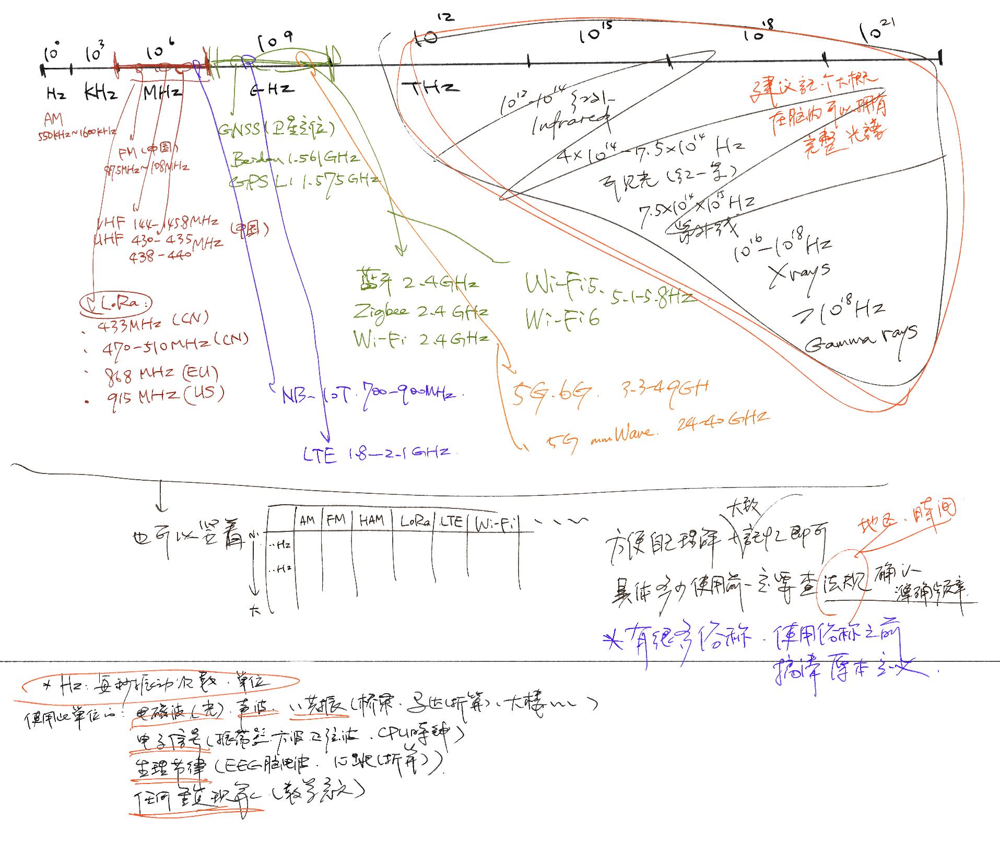

## 电磁光谱快速复习

```
全球基础教育系统（小初高）都会涉及的物理常识，长大了不常用的话容易忘记。不管当时学得好不好，现在可以在没有升学压力的情况下复习整理一下、同时把当时没有学的内容也加进去，形成系统以后都不要再忘了。现在看来还是很有意思的。
```



- 电磁波谱（electromagnetic spectrum）示意图网上反正有不少，也可以先看看这个：[My NASA Data网站的电磁波谱示意图](https://mynasadata.larc.nasa.gov/basic-page/electromagnetic-spectrum-diagram)。这个 [My NASA Data网站](https://mynasadata.larc.nasa.gov) 用真实的NASA地球数据提供教学资源，适用于3-12年级（中国小初高），我觉得挺不错的。  

- 因为现在玩无线通讯设备，我笔记里也多标注了一些现在会接触到的频段。如果要看比较全面的频率分配图的话，搜索关键词：[Worldwide Spectrum Allocations](https://www.google.com/search?q=Worldwide+Spectrum+Allocations)（全球频谱分配），可能你会看到不同版本的海报图。这类海报图通常标注了其绘制公司。在搜索结果里，你可能会看到【Tektronix】、【Rohde & Schwarz】和【Keysight】等关键词，这是全球RF测量行业的三大企业。其中，Tektronix（泰克科技）1946年成立于美国，Keysight分立于2014年、源自惠普（1939成立于美国），Rohde & Schwarz是1933年成立于德国慕尼黑。

- 暂时备注到这里。有些内容可能在业界属于常识级知识，但对我而言不算多余，看到啥想记住的就写下来了。
  
  
  
 
 